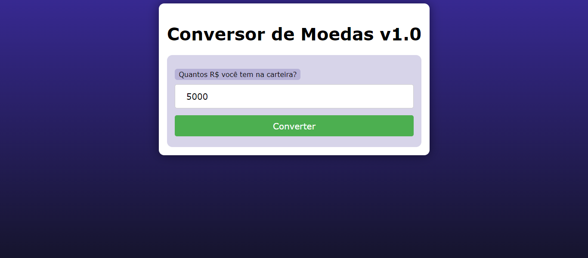
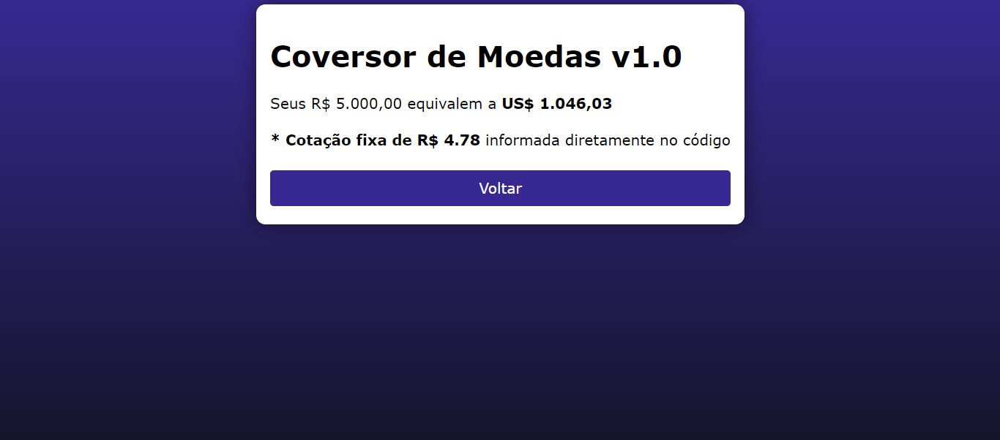

# CONVERSOR DE MOEDAS BASICO
👨‍🏫PROJETO CRIADO PARA O CURSO DE PHP.

  
  

## DESCRIÇÃO:
Este é um aplicativo simples de conversão de moedas, permitindo que o usuário converta uma quantidade em reais para dólares americanos com base em uma cotação fixa. 

- Exibe um formulário solicitando ao usuário que insira a quantidade de reais que deseja converter para dólares.
- O formulário envia os dados para o arquivo `cod.php` usando o método GET quando o botão "Converter" é clicado.
- O `cod.php` Recebe a quantidade de reais fornecida pelo usuário.
- Converte a quantidade de reais para dólares americanos com base em uma cotação fixa de R$ 4,78 por dólar.
- Exibe o resultado da conversão para o usuário.
- Fornecer um botão "Voltar" que permite ao usuário retornar à página de formulário para realizar outra conversão, se desejar.

## EXECUTANDO O PROJETO:
1. **Executando o Aplicativo:**
   - Coloque os arquivos em um servidor web compatível com PHP (por exemplo, XAMPP, WAMP, LAMP).
   - Acesse o formulário no navegador visitando `http://localhost/CODIGO/index.html`.

2. **Interagir com o Projeto:**
   1. Insira a quantidade de reais que deseja converter para dólares no campo fornecido.
   2. Clique no botão "Converter" para enviar o formulário.
   3. Após o processamento, você será redirecionado para uma página que exibirá o valor convertido em dólares.
   4. Se desejar realizar outra conversão, você pode clicar no botão "Voltar" para retornar à página de formulário e inserir outra quantidade de reais.

## CREDITOS:
- [PROJETO CRIADO PARA O CURSO DE PHP](https://github.com/VILHALVA/CURSO-DE-PHP)
- [PROJETO FEITO PELO VILHALVA](https://github.com/VILHALVA)

